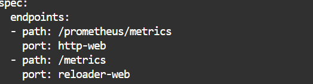
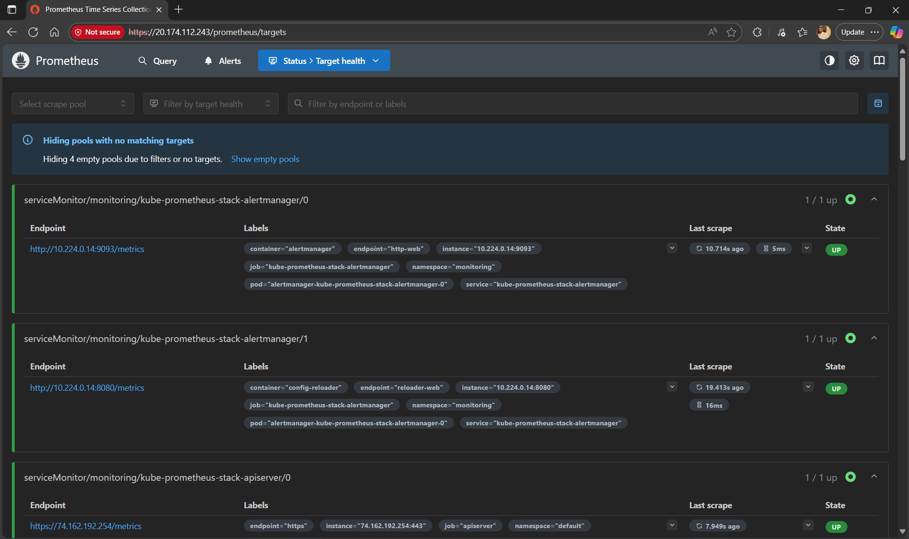

# PWC Microservice Deployment on AKS

TThis project deploys a Python Flask microservice on ***Azure Kubernetes Service (AKS)*** using ***Terraform*** for Infrastructure as Code (IaC) and the ***Azure Portal*** for cluster management. It implements a dual autoscaling strategy using both ***Horizontal Pod Autoscaler (HPA) and Vertical Pod Autoscaler (VPA)*** to ensure optimal performance and resource efficiency.

The application is exposed securely via an NGINX Ingress Controller with TLS termination, and includes a fully integrated monitoring stack using ***Prometheus, Grafana, and Alertmanager*** for observability and alerting.

---

## Quick Access

| Service | URL | Purpose |
|---------|-----|---------|
| **Application** | `https://20.174.112.243` | Flask microservice endpoints |
| **Grafana** | `https://20.174.112.243/grafana` | Metrics visualization and dashboards |
| **Prometheus** | `https://20.174.112.243/prometheus` | Metrics collection and queries |
| **Alertmanager** | `https://20.174.112.243/alertmanager` | Alert routing and management |

---
## Architecture

### High-Level Architecture
```
Internet
    |
    | HTTPS (443) / HTTP (80)
    ↓
Azure Load Balancer (20.174.112.243)
    |
    | HTTP Redirect → HTTPS
    ↓
Nginx Ingress Controller
    |
    | TLS Termination (Self-signed certificate)
    ↓
PWC Microservice Service (ClusterIP: 5000)
    |
    ↓
PWC Microservice Pods (2 replicas)
    |
    | Flask Application (Gunicorn)
    ↓
Backend Logic
    |
    ├─→ /users endpoint
    ├─→ /products endpoint
    ├─→ /health endpoint
    └─→ /metrics endpoint (Prometheus)
```

### Infrastructure Components

- **AKS Cluster**: Managed Kubernetes cluster deployed via Azure Portal
- **Azure Load Balancer**: External load balancer with public IP (20.174.112.243)
- **Nginx Ingress Controller**: Handles traffic routing and TLS termination
- **Flask Microservice**: 2 replicas for high availability
- **Prometheus**: Metrics collection and monitoring
- **Grafana**: Metrics visualization and dashboards

---
---

## Code Modifications and Extensions

The following modifications and extensions were implemented on the base Flask microservice to enable production-grade capabilities for AKS deployment:

### Added Features

- **Logging**: Structured logging for real-time log access, with architecture designed for future EFK (Elasticsearch, Fluentbit, Kibana) stack integration
- **Metrics**: Prometheus-compatible metrics endpoint for standard application monitoring. Custom application metrics for business-specific KPIs and performance tracking
- **Health Monitoring**: Liveness and readiness probes for Kubernetes automated health checks and self-healing

---

### Technical Implementation

### New Routes (`app/routes/`)
- **`health_routes.py`**: `/health` endpoint for Kubernetes probes
- **`metrics_routes.py`**: `/metrics` endpoint for Prometheus scraping
- - **`user_routes.py` & `product_routes.py`**: Instrumented with custom metrics:
  - `user_requests_total`: Total number of requests to `/users` endpoint
  - `product_processing_seconds`: Processing time for `/products` endpoint requests

### Service Layer (`app/services/`)
- **`logging_service.py`**: Centralized structured logging for all HTTP requests and responses. Captures request method, path, client IP, response status. EFK stack-ready format for seamless integration
- **`metrics_service.py`**: Metric registration and updates

### Application Initialization (`app/__init__.py`)
- **Prometheus Integration**: `PrometheusMetrics(app)` automatically exports Flask metrics
- **Structured Logging**: `setup_logging(app)` initializes JSON logs for easy parsing in centralized log systems
- **Request Lifecycle Hooks**: `before_request` logs request metadata. `after_request` logs response details and status
- **Blueprint Registration**: Registers all app routes (`users`, `products`, `health`, `metrics`) cleanly for modular organization

---
---
## Dockerfile

**Multi-stage build** for optimized image size:

- **Stage 1 (Builder)**: Installs Python dependencies using `requirements.txt`
- **Stage 2 (Runtime)**: Copies only necessary files and dependencies from builder stage

**Security**: Runs application as non-root user (`appuser`)

**Production Setup**: Uses Gunicorn WSGI server on port 5000

### Docker Build and Deployment

### Build Docker Image
```bash
docker build -t pwc-microservice:1.0.0 .
```

### Test Locally
```bash
docker run -d -p 5000:5000 --name pwc-microservice pwc-microservice:1.0.0
```

### Azure Container Registry (ACR) Push

**1. Set Azure Subscription**
```bash
az account list --output table
az account set --subscription "Azure subscription 1 - Personal"
```

**2. Get ACR Access Token**
```bash
az acr login --name pwcregistry --expose-token
```

This command returns a JSON response with `username` and `Token` for Docker login.

**3. Docker Login to ACR**
```bash
docker login pwcregistry-hbfzbwfzd5d9d5dw.azurecr.io -u 00000000-0000-0000-0000-000000000000 -p <TOKEN>
```

**4. Tag Image**
```bash
docker tag pwc-microservice:1.0.0 pwcregistry-hbfzbwfzd5d9d5dw.azurecr.io/pwc-microservice:1.0.0
```

**5. Push to ACR**
```bash
docker push pwcregistry-hbfzbwfzd5d9d5dw.azurecr.io/pwc-microservice:1.0.0
```

**6. Verify Image in ACR**
```bash
az acr repository list -n pwcregistry --output table
```


---
---

## Infrastructure as Code (Terraform)

### Overview
Terraform configuration provisions AKS cluster and integrates with existing Azure resources.

### Files

**`providers.tf`**  
Configures required providers: `azurerm` and `azapi`  for Azure resource management.

**`variables.tf`**  
Defines infrastructure variables: resource group name, AKS cluster name, node count, VM size, and ACR name.

**`main.tf`**  
- References existing Resource Group and Azure Container Registry (ACR)
- Creates AKS cluster with system-assigned managed identity
- Configures default node pool with Azure CNI networking
- Enables RBAC for access control
- Grants AKS `AcrPull` permission to pull images from ACR

**`ssh.tf`**  
Generates SSH key pair for AKS node access using Azure API.

**`output.tf`**  
Exports AKS cluster name, FQDN, and kubeconfig for cluster access.

## Infrastructure as Code (Terraform)

### Overview
Terraform configuration provisions AKS cluster and integrates with existing Azure resources.

### Files

**`providers.tf`**  
Configures required providers: `azurerm` and `azapi` for Azure resource management.

**`variables.tf`**  
Defines infrastructure variables: resource group name, AKS cluster name, node count, VM size, and ACR name.

**`main.tf`**  
- References existing Resource Group and Azure Container Registry (ACR)
- Creates AKS cluster with system-assigned managed identity
- Configures default node pool with Azure CNI networking
- Enables RBAC for access control
- Grants AKS `AcrPull` permission to pull images from ACR

**`ssh.tf`**  
Generates SSH key pair for AKS node access using Azure API.

**`output.tf`**  
Exports AKS cluster name, FQDN, and kubeconfig for cluster access.

---

### Execution

**1. Initialize Terraform**
```bash
terraform init
```

**2. Validate Configuration**
```bash
terraform validate
```

**3. Preview Changes**
```bash
terraform plan -out=tfplan
```

**4. Apply Infrastructure**
```bash
terraform apply tfplan
```


**5. Verify AKS Cluster**
```bash
az aks list --output table
```

**6. Get AKS Credentials**
```bash
az aks get-credentials --resource-group Pwc-DevOps-Task --name pwc-aks
```

**7. Verify Cluster Access**
```bash
kubectl get nodes
```

---
---
## Kubernetes Deployment

### Deploys the Flask microservice with high availability and health monitoring

**Key Configuration**:
- **Replicas**: 2 pods for high availability
- **Image**: `pwcregistry-hbfzbwfzd5d9d5dw.azurecr.io/pwc-microservice:1.0.0`

**Container Configuration**:
- **Port**: 5000 (HTTP)
- **Environment Variables**:
  - `FLASK_ENV=production`
  - `PORT=5000`

**Health Probes**:
- **Liveness Probe**: `/health` 
- **Readiness Probe**: `/health` 
 
Both **liveness** and **readiness** probes use the same `/health` endpoint.

**Why?**

This Flask microservice is stateless and doesn't depend on external services (databases, message queues, etc.). If the `/health` endpoint returns `200 OK`, it means:
- The application process is alive and responsive
- The Flask server is ready to handle requests

Since the application has no external dependencies, a single health check is sufficient for both probes. This approach is simpler, cleaner, and fully compatible with Kubernetes best practices.

---

**Apply Deployment**:
```bash
kubectl create namespace pwc-microservice
kubectl apply -f deployment.yaml
kubectl apply -f service.yaml
```

---
---

## Autoscaling Strategy (HPA + VPA)

- ***Fast reaction to load*** → HPA adds pods during spikes
- ***Long-term efficiency*** → VPA fine-tunes resource requests so pods run optimally
  
### HPA Behavior

- **Min Replicas:** 2 (ensures high availability)
- **Max Replicas:** 5 (prevents runaway scaling)
- **Scale Up Trigger:** CPU > 70% OR Memory > 75%
- **Scale Down:** Gradual reduction when usage drops below thresholds

### Apply HPA
```bash
kubectl apply -f k8s/hpa.yaml
```

### VPA Update Mode: `Initial`

The VPA is configured with `updateMode: Initial` to work harmoniously with HPA:

- **Non-disruptive:** Does not automatically restart pods
- **Recommendation-based:** Continuously monitors and generates recommendations
- **Manual control:** Resources updated only when you trigger pod recreation
- **HPA-compatible:** No conflicts with horizontal scaling decisions

### Apply VPA
```bash
kubectl apply -f k8s/vpa.yaml
```

### Check VPA Recommendations
```bash
kubectl describe vpa pwc-microservice-vpa -n pwc-microservice

```

### Check HPA Status
```bash
kubectl get hpa -n pwc-microservice

kubectl describe hpa pwc-microservice-hpa -n pwc-microservice
```
### HPA in action

- Memory utilization: 104% > 75% threshold
  
1. **First Scale Event:**
   - Trigger: Memory resource utilization above target
   - Action: Scaled to 4 pods

2. **Second Scale Event:**
   - Trigger: Memory resource utilization still above target
   - Action: Scaled to 5 pods (maximum reached)
  


## Ingress Configuration (HTTPS/TLS)

### Overview

Secure ingress implementation using **Nginx Ingress Controller** with TLS termination and automatic HTTP to HTTPS redirection.

**External Access**: `https://20.174.112.243`


### Implementation Steps

**1. Install Nginx Ingress Controller**
```bash
kubectl apply -f https://raw.githubusercontent.com/kubernetes/ingress-nginx/controller-v1.9.4/deploy/static/provider/cloud/deploy.yaml

**2. Generate Self-Signed Certificate**
```bash
openssl req -x509 -nodes -days 365 -newkey rsa:2048 \
  -keyout pwc-tls.key \
  -out pwc-tls.crt \
  -subj "/CN=pwc-microservice.local/O=PWC"
```

**3. Create TLS Secret**
```bash
kubectl create secret tls pwc-tls-secret \
  --cert=pwc-tls.crt \
  --key=pwc-tls.key \
  -n pwc-microservice
```

**4. Apply Ingress Configuration**
```bash
kubectl apply -f ingress.yaml
```

**5. Verify Deployment**
```bash
kubectl get ingress -n pwc-microservice
kubectl get svc -n ingress-nginx
```

---

### Testing

**Get Ingress IP**:
```bash
kubectl get svc -n ingress-nginx ingress-nginx-controller
```

**Test Endpoints**:
```bash
INGRESS_IP="20.174.112.243"

# HTTP redirects to HTTPS
curl -I http://$INGRESS_IP/health

# HTTPS endpoints
curl -k https://$INGRESS_IP/health
curl -k https://$INGRESS_IP/users
curl -k https://$INGRESS_IP/products
```
---


### Security Notes

**Current Setup**:
- **Self-signed certificate**: Suitable for testing/internal use
- **TLS termination**: At Ingress level (traffic to pods is HTTP)
- **HTTP redirect**: All traffic forced to HTTPS
  
---
---
## Monitoring Stack Configuration on AKS 

### Overview

Prometheus and Grafana were configured in the AKS cluster to monitor the PWC Flask Microservice, expose both UIs securely over HTTPS using NGINX Ingress, and enable metric collection using Prometheus ServiceMonitor
---

### Helm Installation Steps

**1. Create Monitoring Namespace**
```bash
kubectl create namespace monitoring
```

**2. Add Prometheus Community Helm Repository**
```bash
helm repo add prometheus-community https://prometheus-community.github.io/helm-charts
helm repo update
```

**3. Install kube-prometheus-stack**
```bash
helm install kube-prometheus-stack prometheus-community/kube-prometheus-stack -n monitoring
```

**4. Verify Installation**
```bash
kubectl get pods -n monitoring
kubectl get svc -n monitoring
```

---


---
### Prometheus & Grafana & Alertmanager Configuration
- Secure HTTPS UI access
- Automatic metric scraping via `ServiceMonitor`
- Cluster + application dashboards in Grafana

| Component     | Version / Chart          | Namespace       | Exposure                                  | Authentication       |
|--------------|--------------------------|----------------|-------------------------------------------|---------------------|
| Prometheus   | kube-prometheus-stack    | `monitoring`    | HTTPS `/prometheus` via Ingress           | TLS (self-signed)   |
| Grafana      | kube-prometheus-stack    | `monitoring`    | HTTPS `/grafana` via Ingress              | Default admin login |
| Alertmanager   | kube-prometheus-stack    | `monitoring`    | HTTPS `/alertmanager` via Ingress           | TLS (self-signed) 
| Flask App    | Python + `prometheus_client` | `pwc-microservice` | `/metrics` endpoint                      | ServiceMonitor      |

### Update Prometheus Base Path
```bash
kubectl edit prometheus -n monitoring kube-prometheus-stack-prometheus
```
- externalUrl: "https://<INGRESS_IP>/prometheus"
- routePrefix: "/prometheus"


```bash
kubectl apply -f prometheus-ingress.yaml
```
---

### Update Prometheus Metrics Path in ServiceMonitor
```bash
kubectl edit servicemonitor -n monitoring kube-prometheus-stack-prometheus
```
- Change path:/metrics to path: /prometheus/metrics



---
### Update Alertmanager API URL in Prometheus CR

```bash
kubectl edit prometheus -n monitoring kube-prometheus-stack-prometheus
```
- Change pathPrefix: / to pathPrefix: /alertmanager


---


### Update Alertmanager Metrics Path in ServiceMonitor

```bash
kubectl edit servicemonitor -n monitoring kube-prometheus-stack-alertmanager
```
- Change path:/metrics to path: /alertmanager/metrics


---
### Configure Grafana to serve from /grafana
```bash
kubectl -n monitoring edit configmap kube-prometheus-stack-grafana
```
- root_url = https://<INGRESS_IP>/grafana
- serve_from_sub_path = true


```bash
kubectl -n monitoring edit configmap kube-prometheus-stack-grafana-datasource
```
- Set url to url: http://kube-prometheus-stack-prometheus.monitoring.svc.cluster.local:9090/prometheus

```bash
kubectl -n monitoring rollout restart deployment kube-prometheus-stack-grafana
```
---
### Update Alertmanager Base Path
```bash
kubectl edit alertmanager -n monitoring kube-prometheus-stack-alertmanager
```
- externalUrl: "https://<INGRESS_IP>/alertmanager"
- routePrefix: "/alertmanager"
  


```bash
kubectl apply -f alertmanager-ingress.yaml
```
---
### Access URLs

**Grafana Dashboard**: `https://20.174.112.243/grafana`  

**Prometheus UI**: `https://20.174.112.243/prometheus`

**Alertmanager UI**: `https://20.174.112.243/alertmanager`

**Prometheus Target Health**: `https://20.174.112.243/prometheus/targets`


---

### Alerting System Simulation

- To verify the alert pipeline end-to-end
- This was done by the use of custom alert rule ***(HighUserCount)*** making repeated calls to the /users endpoint to increase the user_requests_total metric above the configured alert threshold 
  
**Alert Displayed in Prometheus**


**Alert Firing in Prometheus**


**Alert Displayed in Alertmanager**


### Custom Application Dashboards

#### 1. PWC Microservice Performance Dashboard (Custom Metrics)


**Purpose**: Demonstrates custom application metrics.

**Custom Metrics Implemented**:
- `user_requests_total`: Counter tracking total requests to `/users` endpoint
- `product_processing_seconds`: Summary measuring processing time for `/products` endpoint

### Python Application Performance Dashboard

**Purpose**: Insight into Python runtime performance, memory behavior, and Flask request latency.


### System Dashboards (Auto-Provisioned)

When Grafana is deployed using the **kube-prometheus-stack** Helm chart, cluster-level dashboards are automatically installed for complete infrastructure observability.


---
---

## Automated Deployment (CI/CD Pipeline)

This project uses **GitHub Actions** to automate the entire build and deployment process to **AKS**.

Whenever new code is pushed to the `main` branch (or triggered manually), a full **CI/CD pipeline** runs automatically.

---

### Configuring GitHub Secrets
| Secret Name | Description |
|--------------|-------------|
| `AZURE_CREDENTIALS` | JSON output from your Service Principal  |
| `ACR_NAME` |  Azure Container Registry name |
| `AKS_CLUSTER` |  AKS cluster|
| `AKS_RESOURCE_GROUP` | Resource group where the AKS cluster is deployed. | 


### Pipeline Steps

1. **Checkout Code**  
   The workflow clones the repository into a GitHub-hosted runner (Ubuntu virtual machine).

2. **Authenticate to Azure**  
   The workflow logs in using a Service Principal stored securely in GitHub Secrets (`AZURE_CREDENTIALS`).

3. **Build Docker Image**  
   The runner builds a Docker image from the project’s `Dockerfile` located in the repository root.

4. **Push to Azure Container Registry (ACR)**  
   The new image is pushed to the ACR registry:  
   `pwcregistry-hbfzbwfzd5d9d5dw.azurecr.io/pwc-microservice:<commit-id>`

5. **Update Kubernetes Manifest**  
   The workflow automatically replaces the old image tag in  
   `k8s/app/deployment.yaml` with the new image version.

6. **Deploy to AKS**  
   The updated manifests in `k8s/app/` are applied to the AKS cluster in the  
   `pwc-microservice` namespace:
   

